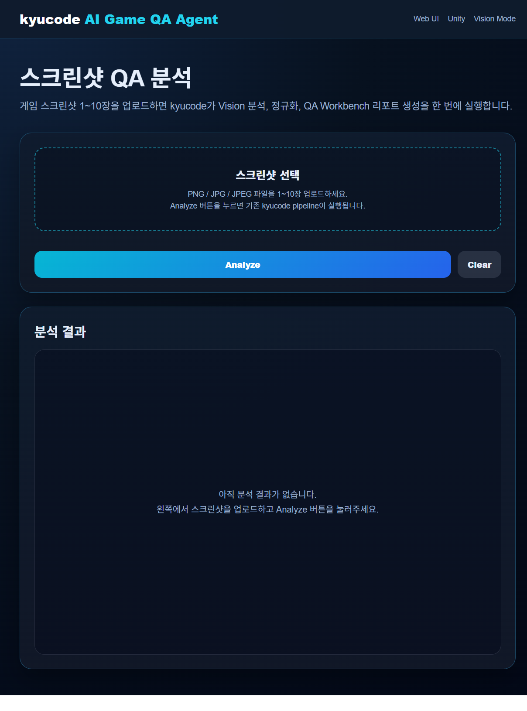
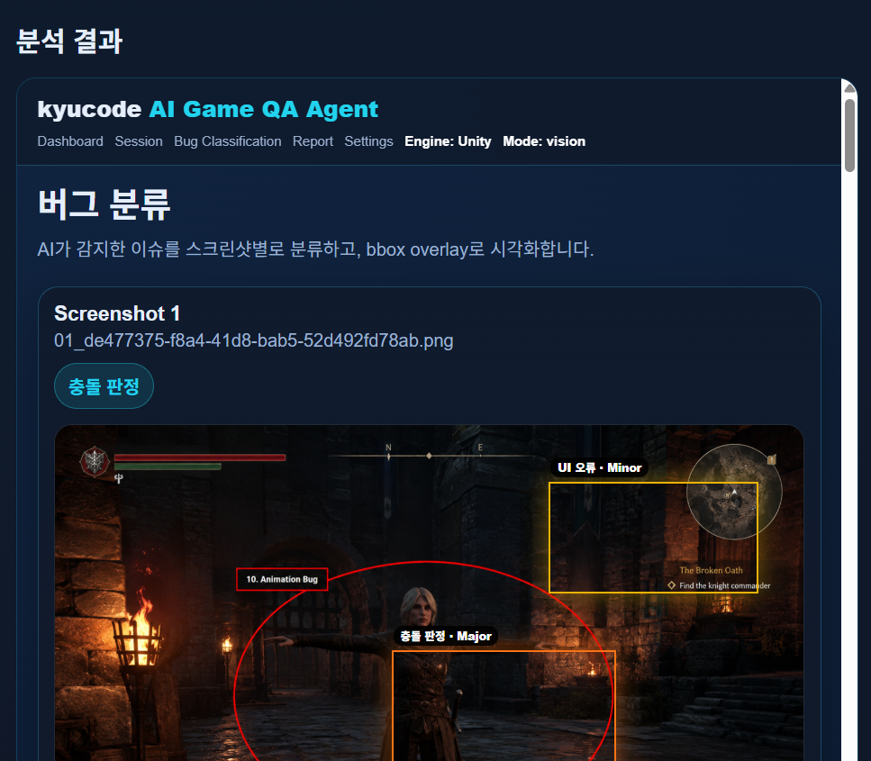
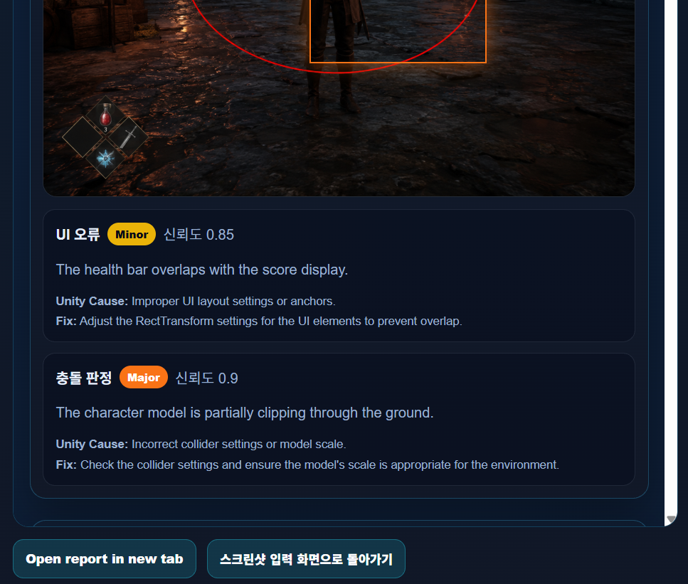
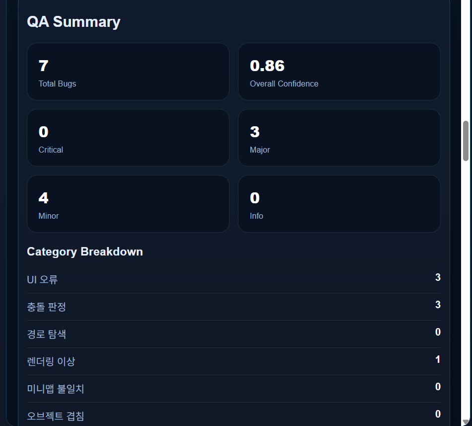
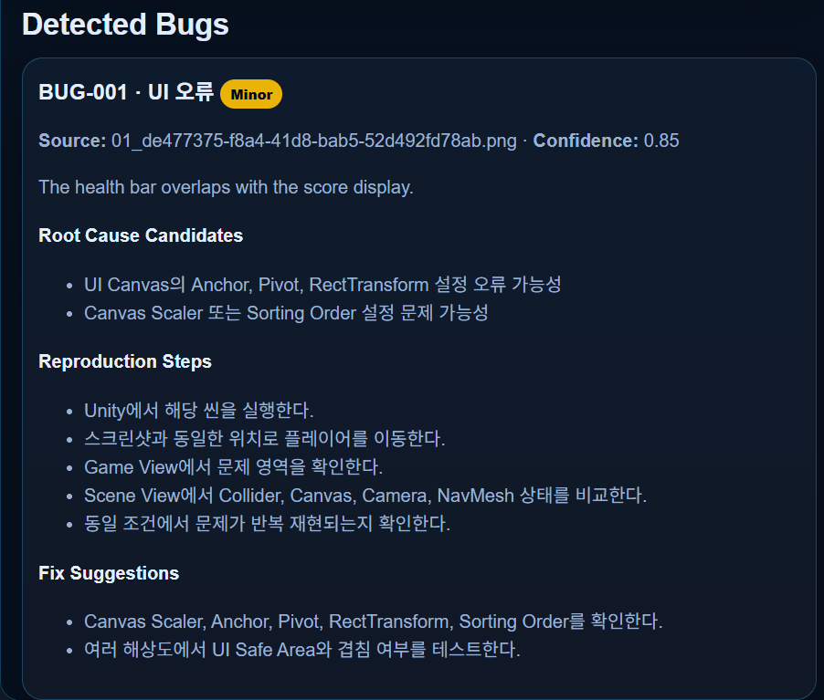
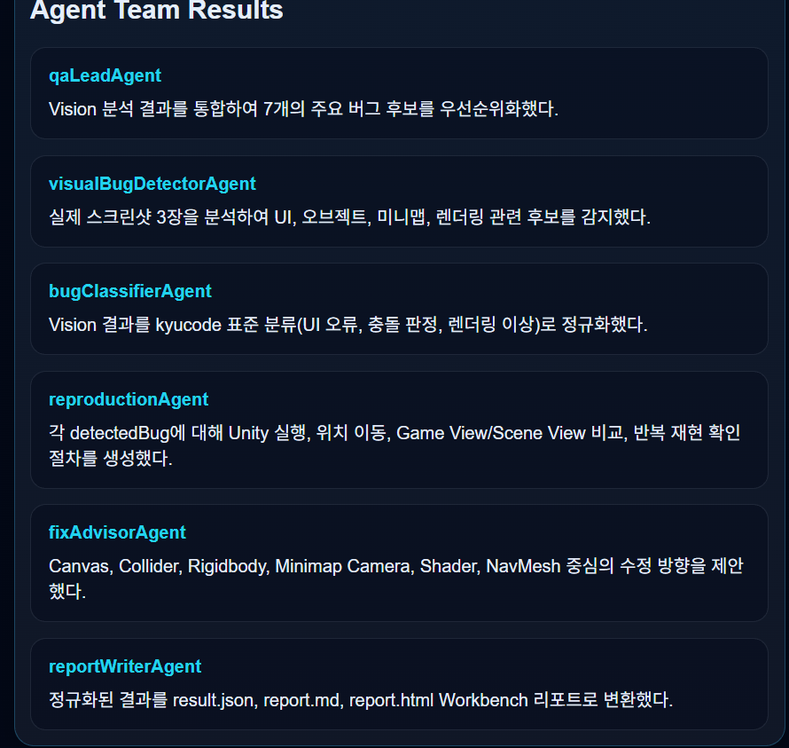

# kyucode - AI Game QA Agent

## 1. 프로젝트 소개

kyucode는 Unity 게임 스크린샷을 분석하여 버그 후보를 탐지하고, 버그 유형, 심각도, 신뢰도, 원인 후보, 재현 절차, 수정 방향을 제안하는 AI Game QA Agent 서비스이다.

이 프로젝트는 단순한 CLI 도구가 아니라, 사용자가 Web UI에서 직접 게임 스크린샷을 업로드하고 분석 결과를 QA Workbench Dashboard 형태로 확인할 수 있도록 설계되었다.

주요 목표는 다음과 같다.

- 게임 QA 과정에서 반복적으로 발생하는 시각적 버그를 빠르게 분류
- Unity 개발자가 확인해야 할 원인 후보 제시
- 재현 절차와 수정 방향 자동 생성
- JSON, Markdown, HTML Dashboard 형태의 결과 출력
- Pi, Skill, MCP, Pi Extension 구조를 활용한 Agent 기반 서비스 구현

---

## 2. 주요 기능

### 2.1 Web UI 기반 스크린샷 업로드

사용자는 브라우저에서 게임 스크린샷 1장부터 10장까지 직접 업로드할 수 있다.

- PNG, JPG, JPEG 지원
- 1장부터 10장까지 업로드 가능
- Analyze 버튼 클릭으로 분석 실행
- 분석 완료 후 결과 Dashboard 표시
- 결과 화면에서 다시 입력 화면으로 돌아가기 가능

### 2.2 Vision 기반 버그 분석

OpenAI Vision API를 활용하여 게임 스크린샷에서 시각적 버그 후보를 탐지한다.

분석 대상 예시:

- UI overlap
- Object clipping
- Minimap mismatch
- Rendering artifact
- Missing texture
- NPC stacking
- Pathfinding issue
- Collision issue
- UI scale or cutoff issue
- Animation bug

### 2.3 버그 분류 및 정규화

Vision 모델의 분석 결과를 kyucode 표준 분류로 정규화한다.

- UI 오류
- 충돌 판정
- 경로 탐색
- 렌더링 이상
- 미니맵 불일치
- 오브젝트 겹침
- 기타

confidence 값은 0.0부터 1.0 범위로 정규화하고, severity는 Critical, Major, Minor, Info로 통일한다.

### 2.4 QA Workbench Dashboard

분석 결과는 output/report_final.html로 생성된다.

Dashboard에서는 다음 정보를 확인할 수 있다.

- 업로드된 스크린샷
- 이미지 위 bbox overlay
- 버그 유형
- severity
- confidence
- QA Summary
- Detected Bugs
- Root Cause Candidates
- Reproduction Steps
- Fix Suggestions
- Agent Team Results

### 2.5 MCP Tool Runner

MCP tool runner를 통해 Agent가 파일 시스템, 분석 파이프라인, 결과 리포트에 접근할 수 있다.

제공 tool:

- list_screenshots
- get_project_status
- read_latest_report
- list_output_files
- run_vision_analysis

### 2.6 Pi Extension 구조

extensions/kyucode-game-qa 폴더를 통해 Web UI, MCP tools, Skill, Vision Pipeline을 하나의 Pi Extension 구조로 묶었다.

---

## 3. 사용한 기술 스택

| 구분 | 기술 |
|---|---|
| Runtime | Node.js |
| Web Server | Express |
| File Upload | Multer |
| AI Vision | OpenAI Vision API |
| Frontend | HTML, CSS, JavaScript |
| Agent Development | Pi Coding Agent |
| Skill | .agents/skills/kyucode-game-qa/SKILL.md |
| MCP | src/mcp/server.js |
| Pi Extension | extensions/kyucode-game-qa |
| Output | JSON, Markdown, HTML |

---

## 4. 설치 방법

### 4.1 프로젝트 클론

    git clone https://github.com/kiyukin/kyucode.git
    cd kyucode

### 4.2 패키지 설치

    npm install

### 4.3 환경 변수 설정

프로젝트 루트에 .env 파일을 생성한다.

    OPENAI_API_KEY=your_api_key_here
    OPENAI_MODEL=gpt-4o-mini
    IMAGE_DETAIL=low

주의 사항:

- .env 파일은 GitHub에 업로드하지 않는다.
- API Key를 코드에 직접 작성하지 않는다.
- IMAGE_DETAIL=low를 사용하여 API 비용을 줄인다.

---

## 5. 실행 방법

### 5.1 Mock mode 실행

    npm start

### 5.2 Vision mode 실행

    npm run vision

### 5.3 결과 정규화

    npm run normalize

또는:

    node src/normalize.js

### 5.4 최종 Dashboard 생성

    node src/render_final_dashboard.js

### 5.5 Web UI 실행

    npm run web

브라우저에서 아래 주소로 접속한다.

    http://localhost:3000

### 5.6 MCP Tool Runner 실행

    npm run mcp

개별 MCP tool 실행 예시:

    node src/mcp/server.js list_screenshots
    node src/mcp/server.js get_project_status
    node src/mcp/server.js list_output_files
    node src/mcp/server.js read_latest_report
    node src/mcp/server.js run_vision_analysis

---

## 6. Web UI 사용 방법

1. npm run web으로 서버 실행
2. http://localhost:3000 접속
3. 게임 스크린샷 1장부터 10장까지 선택
4. Analyze 버튼 클릭
5. 분석 완료 후 QA Workbench Dashboard 확인
6. 필요한 경우 스크린샷 입력 화면으로 돌아가기 버튼으로 초기 화면 복귀

---

## 7. 출력 결과

분석 후 다음 파일이 생성된다.

| 파일 | 설명 |
|---|---|
| output/result.json | 정규화된 분석 결과 |
| output/report.md | Markdown 형식 QA 리포트 |
| output/report.html | HTML 리포트 |
| output/report_final.html | 최종 QA Workbench Dashboard |

---

## 8. Pi / Skill / MCP / Pi Extension 활용 설명

| 필수 요구사항 | 구현 내용 |
|---|---|
| Pi 활용 | Pi Coding Agent를 이용하여 AI Agent 기반 Game QA 서비스 구조를 구현하였다. |
| Skill 활용 | .agents/skills/kyucode-game-qa/SKILL.md에 QA 분석 절차, 버그 분류 기준, 출력 규격을 정의하였다. |
| MCP 활용 | src/mcp/server.js에서 MCP tool runner를 구현하여 스크린샷, output report, Vision 분석 파이프라인에 접근할 수 있게 하였다. |
| Pi Extension 활용 | extensions/kyucode-game-qa에 manifest, README, commands 문서를 구성하여 Web UI, MCP, Skill, Vision Pipeline을 하나의 Extension 구조로 묶었다. |
| Web UI 제공 | npm run web으로 실행되는 업로드, 분석, 결과 확인 Web UI를 제공한다. |

### 8.1 Skill 활용

Skill은 Agent가 특정 작업을 더 정확하고 반복 가능하게 수행하도록 돕는 절차, 기준, 리소스 묶음이다.

kyucode의 Skill 위치:

    .agents/skills/kyucode-game-qa/SKILL.md

이 Skill은 다음 내용을 정의한다.

- 게임 스크린샷 분석 절차
- 버그 유형 분류 기준
- severity 판단 기준
- confidence 정규화 기준
- Unity 원인 후보 작성 방식
- 재현 절차 생성 방식
- 리포트 출력 형식

### 8.2 MCP 활용

kyucode의 MCP tool runner는 Agent가 외부 도구와 데이터에 접근하는 구조를 제공한다.

구현 파일:

    src/mcp/server.js

제공 tool:

| Tool | 설명 |
|---|---|
| list_screenshots | data/screenshots 폴더의 이미지 목록 반환 |
| get_project_status | 프로젝트 상태와 output 파일 존재 여부 반환 |
| read_latest_report | 최신 report.md 또는 result.json 내용 반환 |
| list_output_files | output 폴더의 결과 파일 목록 반환 |
| run_vision_analysis | Vision, Normalize, Dashboard 생성 파이프라인 실행 |

### 8.3 Pi Extension 활용

Extension 구조:

    extensions/kyucode-game-qa/
    ├─ manifest.json
    ├─ README.md
    └─ commands.md

이 Extension은 다음 기능을 하나의 확장 구조로 묶는다.

- Web UI 실행
- MCP server 실행
- Vision 분석 실행
- 최신 리포트 확인
- Skill 문서와 Agent workflow 연결

---

## 9. 프로젝트 구조

    kyucode/
    ├─ .agents/
    │  └─ skills/
    │     └─ kyucode-game-qa/
    │        └─ SKILL.md
    ├─ data/
    │  └─ screenshots/
    ├─ docs/
    │  ├─ mcp.md
    │  └─ screenshots/
    ├─ extensions/
    │  └─ kyucode-game-qa/
    │     ├─ manifest.json
    │     ├─ README.md
    │     └─ commands.md
    ├─ output/
    │  ├─ result.json
    │  ├─ report.md
    │  ├─ report.html
    │  └─ report_final.html
    ├─ public/
    │  └─ index.html
    ├─ src/
    │  ├─ mcp/
    │  │  └─ server.js
    │  ├─ server.js
    │  ├─ vision.js
    │  ├─ normalize.js
    │  ├─ render_final_dashboard.js
    │  └─ fix_responsive_report.js
    ├─ package.json
    └─ README.md

---

## 10. 실행 화면 또는 스크린샷

### 10.1 Web UI - 초기 업로드 화면

사용자는 Web UI에서 스크린샷을 직접 업로드할 수 있다.

### 10.2 이미지와 버그 하이라이트

분석 결과 화면에서는 이미지 위에 bbox overlay를 표시하여 감지된 버그 위치를 시각적으로 보여준다.

### 10.3 버그 유형과 신뢰도

각 스크린샷별로 감지된 버그 유형, 심각도, confidence를 확인할 수 있다.

### 10.4 QA Summary

전체 버그 수, severity별 개수, 카테고리별 분포를 요약한다.

### 10.5 Detected Bugs

Detected Bugs 섹션에서는 각 버그의 원인 후보, 재현 절차, 수정 방향을 확인할 수 있다.

### 10.6 Agent Team Results

Agent Team Results에서는 역할별 Agent의 분석 결과를 확인할 수 있다.

---

## 11. 제한 사항 및 향후 확장

현재 kyucode는 실제 Unity 프로젝트 코드를 자동 수정하지 않고, 버그 원인 후보와 수정 방향을 제안하는 MVP 형태이다.

향후 확장 가능성:

- Unity Console Log 분석
- Player.log 자동 분석
- 실제 Unity 프로젝트 파일 분석
- GitHub Issue 자동 생성
- Jira Ticket 연동
- Regression Test 추천
- 실제 게임 실행 로그 기반 QA 자동화

---

## 12. 요약

kyucode는 Pi, Skill, MCP, Pi Extension, Web UI를 활용하여 구현한 Vision 기반 Unity Game QA Agent 서비스이다.

사용자는 Web UI에서 스크린샷을 업로드하고, Agent는 Vision API를 통해 버그 후보를 탐지한 뒤 QA Workbench Dashboard로 결과를 제공한다.
